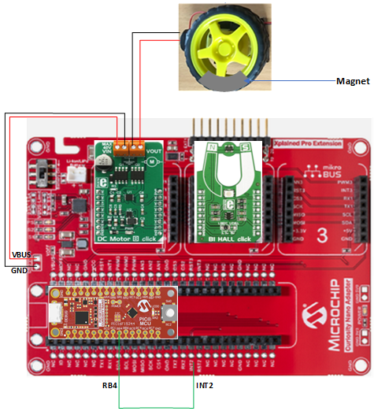

<!-- Please do not change this html logo with link -->

# Interfacing Bipolar Hall Sensor to PIC16F15244 Microcontroller

## Introduction

Some of the applications like internal combustion engine ignition timing, tachometers, anti-lock braking system etc. use bipolar hall sensor. The bipolar hall sensor works on the principle of hall effect and is sensitive to both north and south pole magnetic fields. It generates high to low pulse signal when exposed to north pole magnetic field and low to high pulse when exposed to south pole magnetic field. This code example explains one of the use cases i.e., to measure the speed of the wheel and distance covered by a wheel using bipolar hall sensor interfaced to a microcontroller. 

This code example demonstrates usage of Capture/Compare/PWM (CCP), Timer, Enhanced Universal Synchronous Asynchronous Receiver Transmitter (EUSART) and PWM (Pulse Width Modulation) peripherals of PIC16F15244 microcontroller for interfacing bipolar hall sensor using the capture mode of CCP peripheral available in PIC16F152xx microcontroller family. Here, capture mode of CCP peripheral is used to detect the pulses generated by the bipolar hall sensor in the presence of magnetic field.  Speed of a wheel and distance covered by a wheel are calculated using these captured pulses.

**Note:** ***This example could be generated with all the pin variants of PIC16F152xx family microcontrollers.***

## Related Documentation

- [PIC16F152xx Product Family Page](https://www.microchip.com/en-us/products/microcontrollers-and-microprocessors/8-bit-mcus/pic-mcus/pic16f15244)
- [PIC16F152xx Family Code Examples on GitHub](https://github.com/microchip-pic-avr-examples?q=pic16f15244&type=&language=&sort=) 
- [PIC16F15244 MCU Family Video](https://www.youtube.com/watch?v=nHLv3Th-o-s)
- [PIC16F15244 MCU Product Page](https://www.microchip.com/en-us/product/PIC16F15244)

## Demo Description

This example aims to capture the pulses generated by bipolar hall effect sensor in the presence of magnetic field using CCP peripheral of  the microcontroller.  For the demonstration of the example, PIC16F15244 Curiosity Nano Evaluation kit and Curiosity Nano Base for Click boards are used as a development platform. A small rotating wheel is connected to DC motor. DC motor 8 click is used to drive the DC motor which is used to rotate the wheel. Bi Hall click is used to detect the number of rotations completed by the wheel. Bi Hall click provides digital output, when sensor is exposed to south pole it produces the logic low pulse and when sensor is exposed to north pole it produces the logic high pulse. 

  
   Figure 1 : Block diagram view of the application 

A piece of magnet is sticked on the wheel and Bi Hall click is placed near it, in such a way that every time the wheel rotates, the hall sensor detects it and generates a pulse signal. This pulse signal is captured by the CCP peripheral of microcontroller, and it counts the number of pulses generated within a specified duration. One pulse signal indicates completion of rotation of the wheel. Speed and distance covered by the wheel are calculated based on the number of rotations completed in a specified duration. Calculated speed and distance are displayed on the terminal window through USART interface. Onboard switch of the PIC16F15244 Curiosity Nano board is used to vary the speed of the wheel through PWM interface.

## Software Used

- MPLAB® X IDE [6.10 or newer](http://www.microchip.com/mplab/mplab-x-ide)
- MPLAB® XC8 [2.41 or newer](http://www.microchip.com/mplab/compilers)
- MPLAB® Code Configurator (MCC) [5.3.7 or newer](https://www.microchip.com/mplab/mplab-code-configurator)
- Microchip PIC16F1xxxx Series Device Support [1.19.363 or newer](https://packs.download.microchip.com/) 
- Standalone Data Visualizer [2.20.674 or newer](https://www.microchip.com/en-us/development-tools-tools-and-software/embedded-software-center/atmel-data-visualizer)
- MCC Melody Core 2.6.1
- CCP MCC Melody driver 4.0.12
- TMR0 MCC Melody driver 4.0.11
- TMR1 MCC Melody driver 4.3.6
- TMR2 MCC Melody driver 4.0.16
- UART MCC Melody driver 1.8.0

**Note:** 

 1. ***Integrated MPLAB Data visualizer can also be used as a terminal window.***
 2. ***For running this demo, the installed tool version should be same or later. This example is not tested with the previous versions.***

## Hardware Used

- Curiosity Nano Base for Click boards™[AC164162](https://www.microchip.com/en-us/development-tool/AC164162)
- PIC16F15244 Curiosity Nano Evaluation Kit [EV09Z19A](https://www.microchip.com/en-us/development-tool/EV09Z19A)
- DC motor 8 click [MIKROE-2893](https://www.mikroe.com/dc-motor-8-click) 
- Bi Hall click [MIKROE-1646](https://www.mikroe.com/bi-hall-click)

## Hardware setup 

* Connect PIC16F15244 CNANO board to Curiosity Nano footprint on Curiosity Nano Base for Click boards.
* Insert the DC Motor 8 click to mikroBUS slot 1, and Bi Hall click to mikroBUS slot 2 on Curiosity Nano Base for Click boards.
* Connect VOUT pin and GND pin of DC Motor 8 click to +ve and -ve terminal of the DC Motor.
* Connect VIN pin and GND pin of DC Motor 8 click to VBUS and GND ports of Curiosity Nano Base for Click boards as shown in Figure 2.
* Short pin RB4 in PIC16F15244 CNANO board to INT2 pin in Curiosity Nano Base for Click boards because MCU port is not available for INT2 pin (hall sensor pulse output).

  
   Figure 2 : Hardware Setup connections 

## Hardware connection table

Following table shows the pin connection details of the hardware setup

|Sl No. | Microcontroller pin | Click board/peripheral | Signal name |I/O Pin Direction |
|:---------:|:----------:|:-----------:|:---------:|:------------:|	
| 1     | RC7	| DC Motor 8	        | EN(enables DC motor)	| OUT  |	
| 2     | RC3 	| DC Motor 8	        | PWM(varies speed) 	| OUT  |  
| 3     | RB4 	| Bi Hall 	        | INT(Pulse signal)	| IN   |  
| 4     | RC0 	| EUSART peripheral 	| TX	                | OUT  |		

## Demo Operation

* Setup the hardware as shown in the hardware setup section. Open the Data Visualizer and select Virtual COM port to which PIC16F15244 CNANO board is connected. Refer  [Data Visualizer User Guide](https://www.microchip.com/content/dam/mchp/documents/data-visualizer/40001903B.pdf) for more details.Set the baud rate to 115200 and click on Connect as shown in Figure 3.

  
   Figure 3 : Data Visualizer 

**Note** : ***Alternately, user can use any terminal window to visualize the data.***

* Connect PIC16F15244 Curiosity Nano Board RB4 pin (SDA) to Curiosity Nano Base Board INT2 pin.
* Download and open the project in MPLAB X IDE. Build the project to make sure there are no build errors. Refer [MPLAB User Guide](https://ww1.microchip.com/downloads/en/devicedoc/50002027d.pdf) for more details on how to build.
* Program the microcontroller by clicking on ‘Make and program device’ icon on MPLAB X IDE.
* Start the wheel rotation at low speed , by pressing the onboard switch on PIC16F15244 Curiosity Nano Board. Covered distance and wheel  speed are displayed on terminal window as shown in Figure 4.

  
   Figure 4 : Output displayed on terminal window at low speed of the wheel 

* Change the wheel rotation speed to average speed, by pressing the onboard switch second time. Covered distance and wheel speed are displayed on terminal window as shown in Figure 5.

  
   Figure 5 : Output displayed on terminal window at average speed of the wheel 

* Change the wheel rotation speed to high speed, by pressing the onboard switch third time. Covered distance and wheel speed are displayed on terminal window as shown in Figure 6.

  
   Figure 6 : Output displayed on terminal window at high speed of the wheel 

* Stop the wheel rotation by pressing the onboard switch fourth time. Covered distance remains same and speed is displayed as zero on terminal window as shown in Figure 7.

  
   Figure 7  : Output displayed on terminal window when the wheel stops rotating 

## Conclusion

This  example demonstrates how the pulse signal generated by bipolar hall sensor in the presence of magnetic field is captured by CCP peripheral of PIC16F15244 microcontroller. 

 
